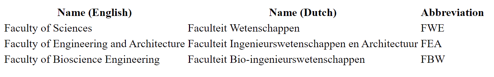

Create a table that looks like the one below:

{:height="100%" width="100%"}

The title of the tab should be `Bèta-faculties UGent`. Focus on the table structure, the lay-out can be as is (without CSS).