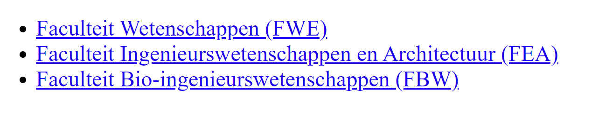

Maak een ongeordende lijst die lijkt op deze hieronder afgebeeld:

{:height="100%" width="100%"}

De links zijn respectievelijk:
```markdown
https://www.ugent.be/we/nl
https://www.ugent.be/ea/nl
https://www.ugent.be/bw/nl
```

Focus op de structuur, de lay-out mag je ongewijzigd laten (zonder CSS).