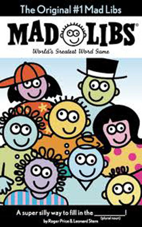
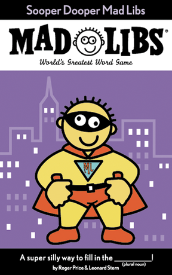
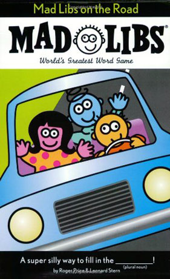
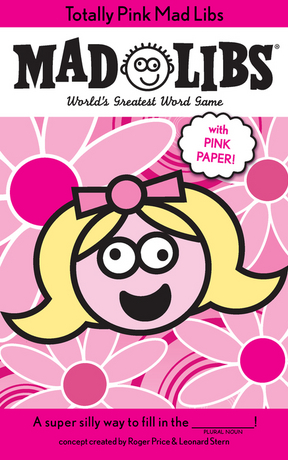
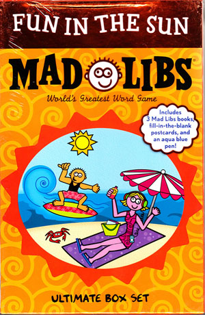
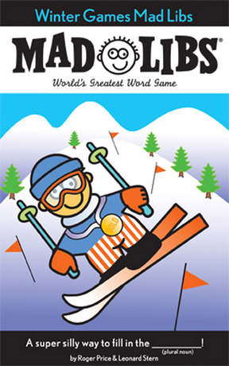

**Mad Libs** is een taalspelletje waarbij wordt vertrokken van een quote of een kort verhaaltje waarin bepaalde sleutelwoorden zijn weggelaten. Onder elk weggelaten woord wordt een lexicale of andere categorie aangegeven, zoals "*zelfstandig naamwoord*", "*werkwoord*", "*plaats*" of "*lichaamsdeel*". Een speler vraagt de andere spelers beurtelings om een bepaald woord te suggereren binnen de categorie die onder het volgende weggelaten woord staat, zonder daarbij de context te onthullen waarin het woord moet gebruikt worden. Op het einde wordt de ingevulde quote of het vervolledigde verhaal luidop voorgelezen. Het resultaat is vaak komisch, surrealistisch en ietwat onzinnig.

Stel dat we bijvoorbeeld vertrekken van de volgende gedeeltelijke quote.

<pre><code>______ created ______ so that __________ would learn ____________.
 <i>Naam</i>           <i>ding</i>           <i>INWONERS</i>               <i>discipline</i>
</code></pre>

De ontbrekende woorden zouden dan op de volgende manier kunnen ingevuld worden

`God` created `war` so that `AMERICANS` would learn `geography`.

of evengoed op de volgende manier

`Mercator` created `maps` so that `BELGIANS` would learn `navigation`.

Dit spelletje werd in 1953 uitgevonden door Leonard Stern en Roger Price, en sinds de reeks voor het eerst werd uitgegeven in 1958 werden alleen al binnen de Verenigde Staten meer dan 110 miljoen exemplaren verkocht van de *Mad Libs* boeken.



## Opgave

Schrijf een klasse `MadLibs` waarvan de objecten kunnen gebruikt worden om een gegeven quote of verhaal waarin sleutelwoorden weggelaten werden, aan te vullen op basis van woorden die willekeurig gekozen werden uit bepaalde categorieën. Elk object van deze klasse moet beschikken over een eigenschap `woordenschat` die verwijst naar een ander object. Dit object stelt de woordenschat voor die het `MadLibs` object aangeleerd gekregen heeft. Initieel is dit woordenschat-object nog leeg, maar tijdens de levensduur van het `MadLibs` object kan er nieuwe informatie aan toegevoegd worden, of kan de informatie in het woordenschat-object geraadpleegd worden bij het aanroepen van de volgende methoden die minimaal door de klasse `MadLibs` moeten ondersteund worden:

- Een methode `leren` waarmee bijkomende woorden in een bepaalde categorie aan de woordenschat van het object kunnen toegevoegd worden. Aan deze methode moeten twee argumenten doorgegeven worden: *i*) de categorie van de nieuwe woorden en *ii*) één of meerdere woorden binnen deze categorie. Indien er als tweede argument één woord wordt doorgegeven, dan mag dat woord als een string doorgegeven worden. Indien er als tweede argument meerdere woorden doorgegeven worden, dan moeten deze woorden onder de vorm van een array doorgegeven worden. De methode moet ervoor zorgen dat het woordenschat-object uitgebreid wordt door de gegeven woorden toe te voegen aan de array waarop de gegeven categorie door het woordenschat-object wordt afgebeeld. Indien er in het woordenschat-object nog geen eigenschap voorkwam die correspondeert met de gegeven categorie, dan moet een nieuw eigenschap-waarde paar aangemaakt worden, waarbij de eigenschap gevormd wordt door de gegeven categorie, en de waarde gevormd wordt door de array van de gegeven woorden. Alle categorieën en woorden die in het woordenschat-object opgenomen worden, moeten steeds omgezet worden naar kleine letters.
- Een methode `suggereren` waarmee een woord uit een bepaalde categorie kan gesuggereerd worden. Deze categorie moet als argument aan de methode doorgegeven worden. De methode moet een willekeurig woord kiezen uit de array waarop de gegeven categorie wordt afgebeeld door het woordenschat-object. Indien de gegeven categorie niet als eigenschap voorkomt in het woordenschat-object, dan moet de methode een `MadLibsError` opwerpen met de boodschap `onbekende categorie`. Als alle letters die voorkomen in de gegeven categorie hoofdletters zijn, dan moeten ook de letters in het gekozen woord omgezet worden naar hoofdletters. Als de eerste letter van de gegeven categorie een hoofdletter is en alle volgende letters kleine letters zijn, dan moet ook de eerste letter van het gekozen woord naar een hoofdletter omgezet worden. Finaal moet de methode (de aangepaste versie van) het gekozen woord als resultaat teruggeven.
- Een methode `invullen` waaraan een string moet doorgegeven worden. Deze string mag fragmenten bevatten die ingesloten zitten tussen twee underscores (`_`). Deze fragmenten geven de naam van een categorie aan, en stellen weggelaten sleutelwoorden van die categorie voor. De methode moet elk van deze fragmenten (inclusief de underscore vooraan en achteraan) vervangen door een willekeurig gekozen woord van die categorie. Hiervoor moet een woord gesuggereerd worden door gebruik te maken van de methode `suggereren`, waarbij dus ook de regels voor het aanpassen van het gesuggereerde woord moeten gelden die geïmplementeerd worden door deze methode. De string waarin alle weggelaten sleutelwoorden zijn vervangen door willekeurig gekozen woorden, moet als resultaat teruggeven worden. Indien de gegeven string een fragment bevat dat niet correspondeert met een categorie in de eigenschap woordenschat, dan moet de methode een `MadLibsError` opwerpen met de boodschap `onbekende categorie`.

## Voorbeeld

```javascript
>> var madlib = new MadLibs();
>> madlib.woordenschat;
{}

>> madlib.leren('naam', 'God');
>> madlib.leren('ding', 'war');
>> madlib.leren('inwoners', 'Americans');
>> madlib.leren('discipline', 'geography');
>> madlib.woordenschat;
{'ding': ['war'], 'naam': ['god'], 'discipline': ['geography'], 'inwoners': ['americans']}
>> madlib.suggereren('naam');
'god'
>> madlib.suggereren('NAAM');
'GOD'
>> madlib.suggereren('Naam');
'God'
>> madlib.invullen('_Naam_ created _ding_ so that _INWONERS_ would learn _discipline_.');
'God created war so that AMERICANS would learn geography.'

>> madlib.leren('naam', ['Mercator', 'Caesar']);
>> madlib.leren('ding', ['maps', 'coordinates']);
>> madlib.leren('inwoners', ['Belgians', 'Martians', 'Germans'])
>> madlib.leren('discipline', 'navigation');
>> madlib.leren('discipline', 'colonisation');
>> madlib.woordenschat;
{'ding': ['maps', 'war', 'coordinates'], 'naam': ['god', 'caesar', 'mercator'], 'discipline': ['colonisation', 'navigation', 'geography'], 'inwoners': ['belgians', 'americans', 'germans', 'martians']}
>> madlib.invullen('_Naam_ created _ding_ so that _INWONERS_ would learn _discipline_.');
'Mercator created maps so that BELGIANS would learn geography.'
>> madlib.invullen('_Naam_ created _ding_ so that _INWONERS_ would learn _discipline_.');
'Mercator created war so that BELGIANS would learn navigation.'
```
