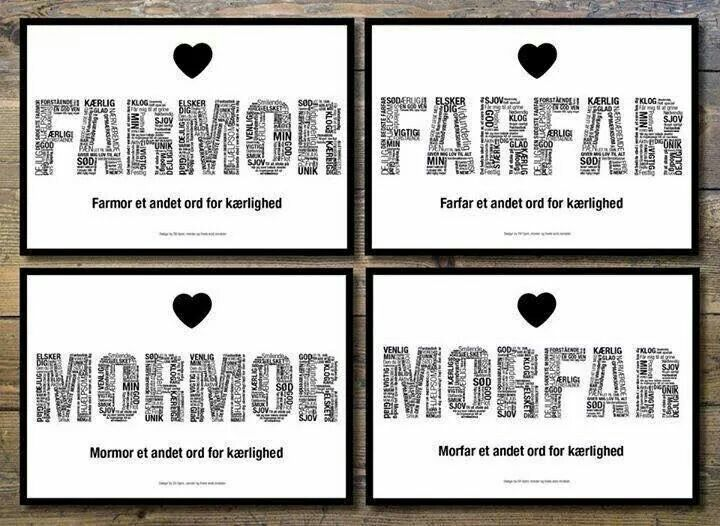
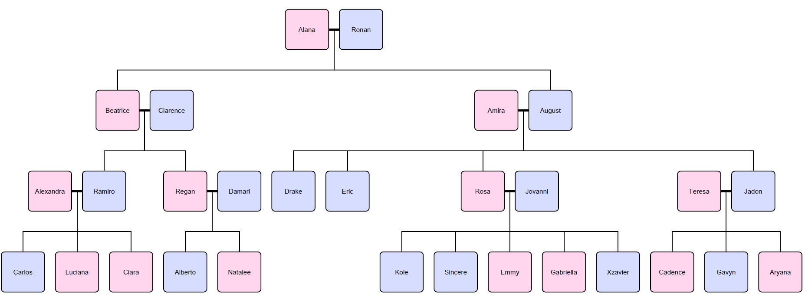

<p>Een van de boeiendste dingen aan het leren van vreemde talen is de
    vaststelling dat sommige woorden onmogelijk kunnen vertaald worden.
    Gewoonweg omdat ze geen directe tegenhanger hebben in onze taal. Want hoe
    vertaal je in hemelsnaam de veertien verschillende woorden die eskimo's
    gebruiken voor sneeuw? Of het Zweedse woord <i>lagom</i>, dat zoveel
    betekent als "niet te veel, en niet te weinig". Ook het Duitse woord <i>&#252;berhaupt</i>
    bleek z&#243; moeilijk te vertalen dat we het uiteindelijk ongewijzigd
    hebben overgenomen.</p>
<p>Zo heeft het Zweeds ook geen woorden die equivalent zijn aan grootmoeder
    of grootvader. Bij het benoemen van hun voorouders zullen Zweden immers <b>altijd</b>
    aangeven of ze verwijzen naar de afstamming langs moeders- of vaderszijde.
    In het Zweeds vertaal je moeder door <i>mor</i> en vader door <i>far</i>.
    Je grootmoeder langs moederszijde wordt dan <i>mormor</i> (letterlijk: je
    moeder's moeder) en je grootmoeder langs vaderszijde <i>farmor</i>
    (letterlijk: je vader's moeder). Analoog vertaal je grootvader langs
    moederszijde door <i>morfar</i> en grootvader langs vaderszijde door <i>farfar</i>.
    Als je dat toch naar het Nederlands zou willen vertalen, dan kom je uit
    bij iets als mama, mapa, pama en papa. En dat lijkt toch echt wel nergens
    op?</p>
<div class="dodona-centered-group">
</div>
<p>Op dezelfde manier verwijzen Zweden naar hun overgrootouders,
    bedovergrootouders en nog verdere voorouders. Zo is <i>morfarfar</i>
    bijvoorbeeld je moeder's vader's vader, en is <i>farmorfarmor</i> je
    vader's moeder's vader's moeder.</p>
<p>De Zweedse manier om voorouders te omschrijven levert soms ingewikkelde
    situaties op. Voorouders worden immers op verschillende manieren
    aangesproken door hun nakomelingen, zelfs al zijn die van dezelfde
    generatie. Heeft een grootmoeder kleinkinderen van haar zonen &#233;n haar
    dochters, dan lopen die door elkaar <i>farmor</i> en <i>mormor</i> te
    schreeuwen. Ondertussen weet grootvader niet meer of hij nu eerst op <i>morfar</i>
    dan wel op <i>farfar</i> moet reageren.</p>
<h3>Opgave</h3>
<p>In deze opgave werken we met familiestambomen die opgesteld werden
    volgens een vereenvoudigd model, waarbij steeds aan de volgende
    voorwaarden voldaan is:</p>
<ul>
    <li>
        <p>elke persoon heeft een unieke naam, die geen spaties bevat</p>
    </li>
    <li>
        <p>elke persoon heeft hoogstens met &#233;&#233;n partner (van het ander
            geslacht) kinderen</p>
    </li>
    <li>
        <p>elk kind heeft altijd &#233;&#233;n moeder en &#233;&#233;n vader;
            ouders zijn niet noodzakelijk opgenomen in de stamboom, maar als
            &#233;&#233;n van de ouders van het kind is opgenomen, dan is de
            andere dat automatisch ook</p>
    </li>
    <li>
        <p>elke persoon heeft in de stamboom een uniek pad naar elk van zijn
            voorouders</p>
    </li>
</ul>
<p>Onderstaande afbeelding toont een voorbeeld van zo een familiestamboom,
    waarbij vrouwen worden aangeduid in het roze en mannen in het blauw.
    Koppels met kinderen worden verbonden door een dikke horizontale streep,
    en de overige relaties moeten van boven naar onder gelezen worden, met
    bovenaan de moeder en de vader, en daaronder hun kinderen. De laatste
    voorwaarde die we opgelegd hebben aan familiestambomen betekent dat er
    geen incest is binnen een stamboom (er komen bijvoorbeeld dus nooit
    kinderen voort uit een relatie tussen een vader en zijn dochter, of uit
    relaties tussen neven en nichten).</p>
<div class="dodona-centered-group"></div>
<p>De relaties uit een familiestamboom worden opgeslaan in een tekstbestand,
    waarvan elke regel bestaat uit drie of meer namen die van elkaar
    gescheiden worden door spaties. De eerste naam is die van de moeder, de
    tweede die van de vader, en de overige namen die van hun kinderen. Op die
    manier bevat onderstaand voorbeeldbestand alle relaties uit de
    familiestamboom in bovenstaande afbeelding.</p>
<pre>Alana Ronan Beatrice August
Beatrice Clarence Ramiro Regan
Alexandra Ramiro Carlos Luciana Ciara
Regan Damari Alberto Natalee
Amira August Drake Eric Rosa Jadon
Rosa Jovanni Kole Sincere Emmy Gabriella Xzavier
Teresa Jadon Cadence Gavyn Aryana</pre>
<p>Merk op dat er geen vaste volgorde is waarin de regels van het bestand
    opgelijst worden. Gevraagd wordt:</p>
<ul>
    <li>
        <p>Schrijf een functie <samp>familieleden</samp> waaraan de locatie van
            een tekstbestand moet doorgegeven worden. Dit tekstbestand moet
            informatie bevatten over een familiestamboom, in het formaat zoals
            hierboven beschreven. De functie moet een object teruggeven dat de
            namen van alle leden uit de familiestamboom afbeeldt op een object
            dat de volgende sleutels kan bevatten:</p>
    </li>
    <ul>
        <li>
            <p><samp>moeder</samp>: wordt afgebeeld op de naam van de moeder van
                het familielid</p>
        </li>
        <li>
            <p><samp>vader</samp>: wordt afgebeeld op de naam van de vader van het
                familielid</p>
        </li>
        <li>
            <p><samp>kinderen</samp>: wordt afgebeeld op een lijst met de
                namen van alle kinderen van het familielid</p>
        </li>
    </ul>
    <p>Enkel sleutels die overeenkomen met relaties waarover informatie kan
        afgeleid worden uit het gegeven tekstbestand mogen opgenomen worden in
        het object.</p>
</ul>
<ul>
    <li>
        <p>Schrijf een functie <samp>voorouder</samp> waaraan drie argumenten
            moeten doorgegeven worden: <i>i</i>) de naam van een familielid, <i>ii</i>)
            de Zweedse omschrijving van een voorouder en <i>iii</i>) een
            object dat de relaties in een familiestamboom omschrijft
            (opgemaakt zoals de objecten die worden teruggegeven door de
            functie <samp>familieleden</samp>). De functie moet de naam
            teruggeven van de voorouder die door het gegeven familielid in het
            Zweeds wordt aangesproken met de gegeven omschrijving, rekening
            houdend met de relaties in de gegeven familiestamboom. Hierbij mag de
            functie ervan uitgaan dat de gegeven naam van het familielid als
            sleutel voorkomt in het gegeven object, en dat de Zweedse
            omschrijving van de voorouder een string is die is samengesteld uit de
            deelstrings <samp>mor</samp> en <samp>far</samp>, zonder dat dit
            expliciet moet gecontroleerd worden. Indien de gegeven familiestamboom
            geen voorouder van het gegeven familielid bevat die wordt aangesproken
            met de gegeven omschrijving, dan moet de functie een <samp>AssertionError</samp>
            opwerpen met de boodschap <samp>onbekende voorouder</samp>.</p>
    </li>
    <li>
        <p>Schrijf een functie <samp>nakomelingen</samp> waaraan drie
            argumenten moeten doorgegeven worden: <i>i</i>) de naam van een
            familielid, <i>ii</i>) een getal $$n \in \mathbb{N}_0$$ en <i>iii</i>)
            een object dat de relaties in een familiestamboom omschrijft
            (opgemaakt zoals de objecten die worden teruggegeven door de
            functie <samp>familieleden</samp>). De functie moet een object
            teruggeven waarvan de sleutels bestaan uit alle Zweedse omschrijvingen
            waarmee het gegeven familielid wordt aangesproken door zijn/haar
            $$n$$-de generatie nakomelingen uit de gegeven familiestamboom. Elk
            van deze omschrijvingen moet door het object afgebeeld worden op
            een lijst met alle nakomelingen uit de gegeven familiestamboom
            die het gegeven familielid met die omschrijving aanspreken. Deze lijst 
            moet alfabetisch gesorteerd worden. Hierbij
            mag de functie ervan uitgaan dat de gegeven naam van het familielid
            als sleutel voorkomt in het gegeven object, zonder dat dit
            expliciet moet gecontroleerd worden. De generaties nakomelingen worden
            bepaald relatief ten opzichte van het gegeven familielid: de eerste
            generatie bestaat uit de kinderen van het familielid, de tweede
            generatie uit de kleinkinderen, de derde generatie uit de
            achterkleinkinderen, enzoverder.</p>
    </li>
</ul>
<h3>Voorbeeld</h3>
<p>Bij onderstaande voorbeeldsessie gaan we ervan uit dat het bestand <a target="_blank"
                                                                         href="media/data/data.txt"><samp>data.txt</samp></a>
    zich in de huidige
    directory bevindt. Dit is het tekstbestand dat overeenkomt met de
    familiestamboom die als voorbeeld gebruikt werd bij de omschrijving van de
    opgave.</p>

```javascript
>> const relaties = familieleden('data.txt');
>> relaties['Sincere'];
{'vader': 'Jovanni', 'moeder': 'Rosa'}
>> relaties['August'];
{'vader': 'Ronan', 'moeder': 'Alana', 'kinderen': ['Eric', 'Drake', 'Jadon', 'Rosa']}
>> relaties['Ronan'];
{'kinderen': ['Beatrice', 'August']}

>> voorouder('Drake', 'mor', relaties);
'Amira'
>> voorouder('Rosa', 'farmor', relaties);
'Alana'
>> voorouder('Sincere', 'morfarfar', relaties);
'Ronan'
>> voorouder('Luciana', 'morfarmor', relaties);
AssertionError: onbekende voorouder

>> nakomelingen('Ronan', 1, relaties);
{'far': [ 'August', 'Beatrice']}
>> nakomelingen('Ronan', 2, relaties);
{'morfar': ['Ramiro', 'Regan'], 'farfar': ['Drake', 'Eric', 'Jadon', 'Rosa']}
>> nakomelingen('Ronan', 3, relaties);
{'farmorfar': ['Carlos', 'Ciara', 'Luciana'], 'farfarfar': ['Aryana', 'Cadence', 'Gavyn'], 'mormorfar': ['Alberto', 'Natalee'], 'morfarfar': ['Emmy', 'Gabriella', 'Kole', 'Sincere', 'Xavier']}
```

<h3>Epiloog</h3>
<p>Het woord <i>mamihlapinatapais</i> uit de taal van het <a target="_blank"
                                                             href="https://nl.wikipedia.org/wiki/Yahgan">Yaghanvolk</a>
    dat in het
    ijzige Vuurland woont, wordt beschouwd als het meest beknopte woord ter
    wereld &#8212; ook het woord dat het moeilijkst te vertalen valt. Het
    betekent zoveel als "een blik die twee personen elkaar toewerpen, waarbij
    ze elk willen dat de ander iets op gang brengt waar ze alletwee vurig naar
    verlangen, maar waarvoor geen van beide zin heeft om het initiatief te
    nemen".</p>
<p>Een bevraging uit 2004 onder 1000 taalkundigen leverde nog een ander
    woord op dat het moeilijkst te vertalen woord ter wereld zou moeten zijn:
    <i>ilunga</i>. Het woord is afkomstig uit het <a target="_blank" href="https://nl.wikipedia.org/wiki/Luba-Kasai">Tshiluba</a>,
    een Bantoetaal die gesproken wordt in de Democratische Republiek Congo,
    die daar ook een offici&#235;le taal is die in het onderwijs gebruikt
    wordt. Het betekent "een persoon die bereid is om misbruik een eerste keer
    te vergeven, en het ook een tweede keer nog tolereert, maar nooit een
    derde keer".</p>
<p>Hier zijn nog enkele favoriete woorden van taalkundige Mikael Parkvall
    van de Universiteit van Stockholm, uit zijn <a target="_blank"
                                                   href="https://www.amazon.com/Limits-Language-Almost-Everything-Languages/dp/1590281985/ref=sr_1_1?ie=UTF8&amp;qid=1490684258"><i>Limits
        of language: almost everything you didn't know about language and
        languages</i></a> (2006):</p>
<ul>
    <li>
        <p><i>klunen</i> (Fries): wandelen of lopen over land met schaatsen aan
            (doorgaans om zich van het ene bevroren wateroppervlak naar het andere
            te begeven)</p>
    </li>
    <li>
        <p><i>a&#611;one</i> (Kuot): op zo een manier uit een fles drinken dat
            de straaltjes kwijl uit de mond terug in de fles lopen</p>
    </li>
    <li>
        <p><i>fringsen</i> (Duits): het stelen van steenkool uit treinwagons of
            aardappelen van de velden om te kunnen overleven</p>
    </li>
    <li>
        <p><i>knedlikov&#253;</i> (Tsjechisch): over knoedels (dumplings) die
            vrij onvolledig zijn</p>
    </li>
    <li>
        <p><i>qamigartuk</i> (Yup'ik): hij die in het voorjaar op zeehondenjacht
            gaat met een kleine slee en een kajak</p>
    </li>
    <li>
        <p><i>bale&#331;ga</i> (Chavacano): overmatig zwaaien met de armen
            tijdens het wandelen</p>
    </li>
    <li>
        <p><i>kallsup</i> (Zweeds): een slok water die door een zwemmer per
            ongeluk ingeslikt wordt</p>
    </li>
    <li>
        <p><i>googly</i> (Engels): (over een bal die geworpen wordt in cricket)
            vermomd door de werper met een actie die schijnbaar de benen doet
            breken</p>
    </li>
</ul>
<p>Gunwinggu &#8212; een taal gesproken in het noordwesten van
    Australi&#235; &#8212; kent afzonderlijke werkwoorden als beschrijving
    voor het rondhuppelen van verschillende soorten kangoeroes:</p>
<ul>
    <li>
        <p><i>kamurlbardme</i>: het rondhuppelen van een zwarte wallaroe (<a target="_blank"
                                                                             href="https://nl.wikipedia.org/wiki/Zwarte_wallaroe"><i>Macropus
            bernardus</i></a>)</p>
    </li>
    <li>
        <p><i>kalurlhlurme</i>: het rondhuppelen van een zandwallaby (<a target="_blank"
                                                                         href="https://nl.wikipedia.org/wiki/Zandwallaby"><i>Macropus
            agilis</i></a>)</p>
    </li>
    <li>
        <p><i>kamawudme</i>: het rondhuppelen van een mannelijke
            antilopekangoeroe (<a target="_blank" href="https://nl.wikipedia.org/wiki/Antilopekangoeroe"><i>Macropus
                antilopinus</i></a>)</p>
    </li>
    <li>
        <p><i>kadjalwahme</i>: het rondhuppelen van een vrouwelijke
            antilopekangoeroe (<a target="_blank" href="https://nl.wikipedia.org/wiki/Antilopekangoeroe"><i>Macropus
                antilopinus</i></a>)</p>
    </li>
</ul>
