Welcome to Dodona! In Dodona you always work inside a course. A teacher fills the course with **activities**, grouped into series. There are two kinds of activity: reading activities and programming exercises.

### Where you are

A series looks like this:

  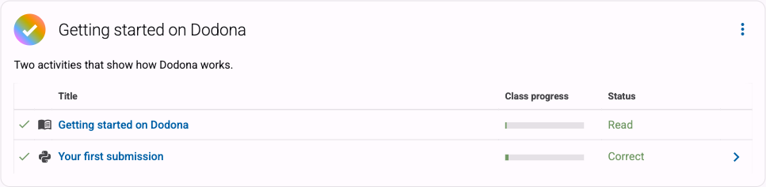
  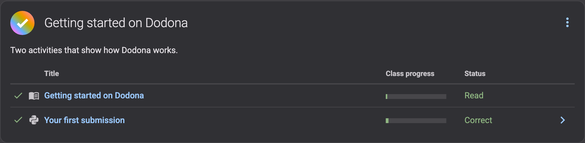

A series has a title, a short description, sometimes a deadline, and then the list of activities. In front of each activity there is a check mark once you have finished it, next to that an icon for the kind of activity, and on the right your status in words.

### This page is a reading activity

A reading activity is text: an explanation, an example, a piece of theory. There is no code editor and there is nothing to hand in. Once you have read it, press the button at the bottom of the page:

  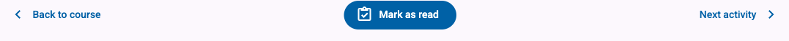
  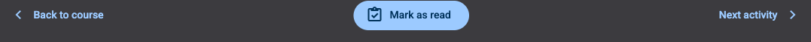

The button is then replaced by the moment you did it, and the activity gets a check mark in the series:

  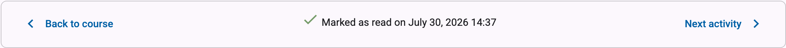
  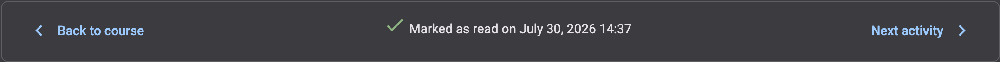

> Marking a page as read only records your progress, for you and for the teacher. You can come back and reread the page as often as you want.
{: .callout.callout-info}

### With an exercise you write code

A programming exercise is the second kind of activity. Under the assignment you get a code editor, and that is where you write your solution.

  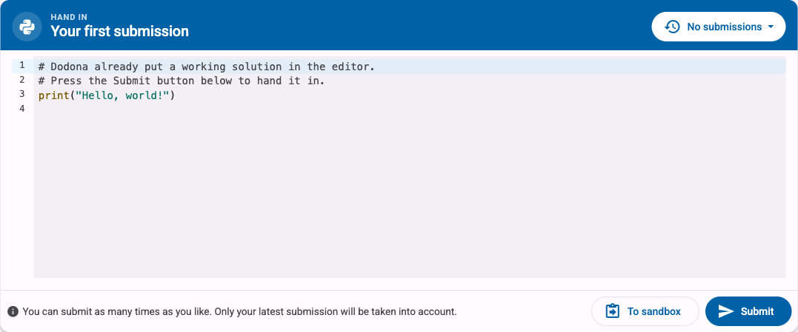
  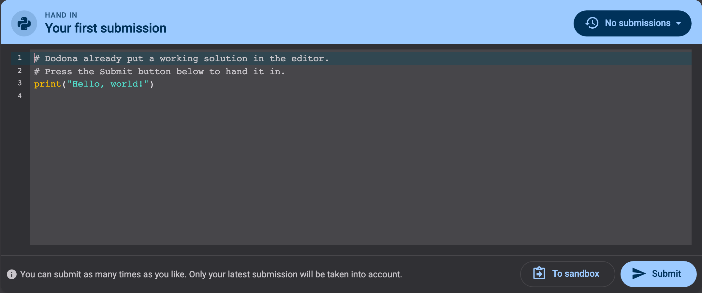

1. The editor sometimes already holds some starting code. You can change it, add to it, or clear it out.
2. For Python exercises you can try your code in your browser first, with **To sandbox**. Nothing is handed in yet, so experiment freely.
3. When you are happy with it, press **Submit**. Dodona runs your code against a series of tests and shows you the result within seconds.

### Reading the feedback

If your code passes every test, you get a green **Correct**:

  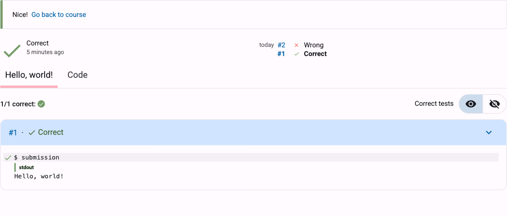
  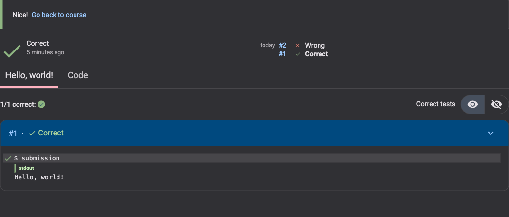

If it does not, you get a red **Wrong**, and Dodona shows you which test failed and how your output differs from what was expected:

  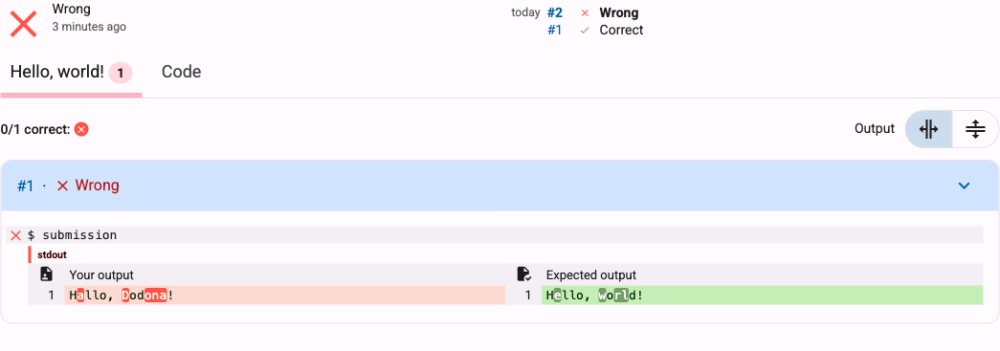
  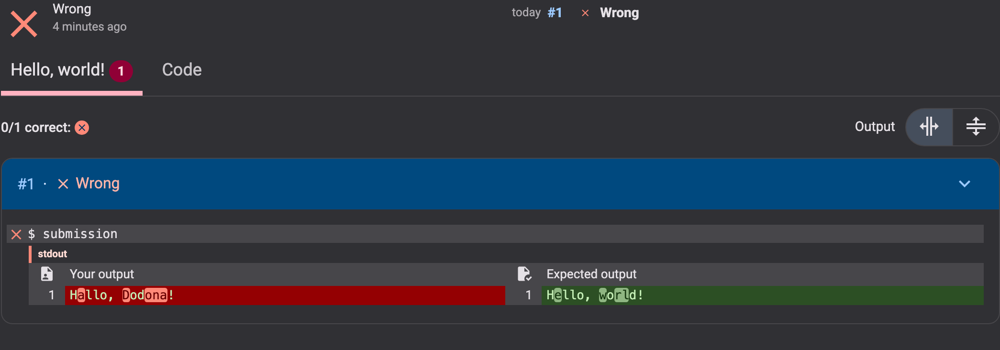

Three habits make that feedback easier to interpret:

- **Look at the failing test first.** That is where it says what actually went wrong. The count at the top (`0/1 correct`) only tells you how many tests passed, not what to change.
- **Compare the two columns.** Your output is on the left, the expected output on the right, and the characters that differ are highlighted. Watch out for the small stuff: a capital letter, a comma, a space at the end of a line.
- **Fix one thing, then submit again.** Changing five things at once makes it hard to see which one helped.

The verdict at the top of the feedback is one of these:

  <table class="table table-condensed">
    <thead>
      <tr style="background-color: var(--d-code-bg);">
        <th></th>
        <th>Verdict</th>
        <th>What it means</th>
      </tr>
    </thead>
    <tbody>
      <tr>
        <td><i class="mdi mdi-check mdi-18 colored-correct" aria-hidden="true"></i></td>
        <td>Correct</td>
        <td>Every test passed.</td>
      </tr>
      <tr>
        <td><i class="mdi mdi-close mdi-18 colored-wrong" aria-hidden="true"></i></td>
        <td>Wrong</td>
        <td>Your code ran, but at least one test did not produce the expected result.</td>
      </tr>
      <tr>
        <td><i class="mdi mdi-flash mdi-18 colored-wrong" aria-hidden="true"></i></td>
        <td>Runtime error</td>
        <td>Your code crashed while it was running. The error message is in the feedback.</td>
      </tr>
      <tr>
        <td><i class="mdi mdi-lightning-bolt-circle mdi-18 colored-wrong" aria-hidden="true"></i></td>
        <td>Compilation error</td>
        <td>Your code could not be read at all, usually a typo or a syntax error.</td>
      </tr>
      <tr>
        <td><i class="mdi mdi-alarm mdi-18 colored-wrong" aria-hidden="true"></i></td>
        <td>Timeout</td>
        <td>Your code took too long, often because of a loop that never ends.</td>
      </tr>
    </tbody>
  </table>

### Comments from the teacher

The tests are automatic, but the teacher can also read your code and leave comments on specific lines. Those show up with your submission, under the **Code** tab:

  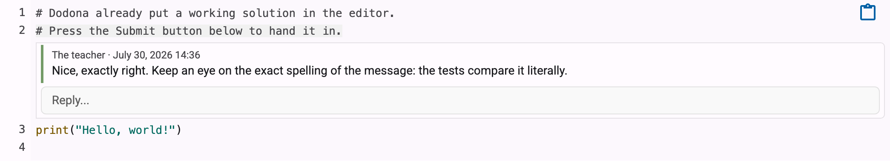
  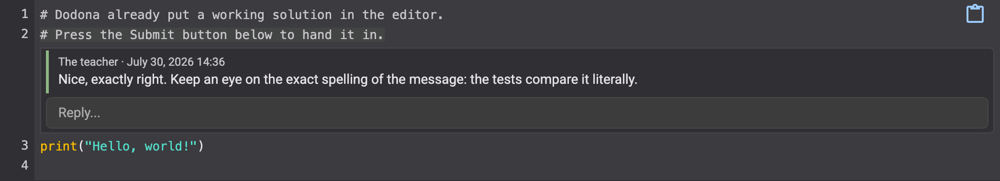

You can reply right underneath, so a comment is the start of a conversation rather than a final word.

### Submitting again is free

You may submit as often as you like. Every attempt is kept and you can open the old ones from the submission history, so nothing you tried is ever lost:

  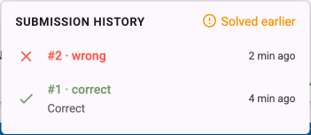
  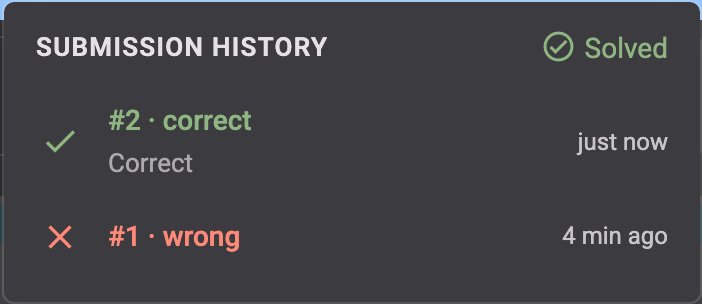

Only your latest submission counts, so a wrong attempt costs you nothing.

### Your turn

That is all you need to know. If the teacher put the exercise **Your first submission** next in this series, open it now: the solution is already written for you, so all you have to do is press **Submit** and watch the feedback appear.

And when you are done reading, press **Mark as read** below.

