Welkom op Dodona, het platform waar je nu naar kijkt. Je leraar vult een cursus met **activiteiten**, gebundeld in reeksen. Er bestaan maar twee soorten activiteiten, en deze pagina laat je ze allebei zien.

### Waar je zit

Een reeks ziet er zo uit. Het icoontje vooraan een activiteit zegt welke soort het is, het icoontje achteraan hoe ver je staat.

  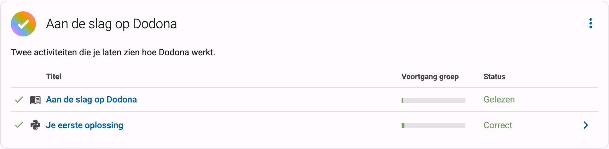
  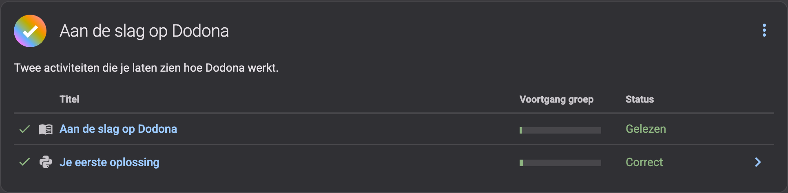

### Deze pagina is een leesactiviteit

Een leesactiviteit is tekst: een uitleg, een voorbeeld, een stukje theorie. Er is geen editor en er valt niets in te dienen. Als je ze gelezen hebt, klik je op de knop onderaan de pagina:

  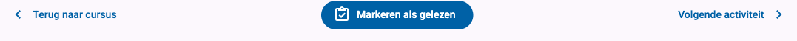
  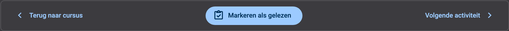

De knop maakt dan plaats voor het moment waarop je dat deed, en de activiteit krijgt een vinkje in de reeks:

  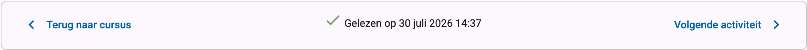
  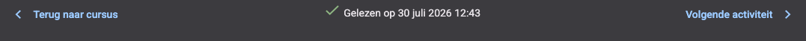

> **Dit is geen test.**
> Een pagina als gelezen markeren houdt enkel je voortgang bij, voor jou en voor je leraar. Er gaat niets op slot: je kunt zo vaak terugkomen en herlezen als je wilt.
{: .callout.callout-info}

### Een oefening heeft een invulvak

Een oefening is de andere soort activiteit. Onder de opgave krijg je een editor, en daar schrijf je je oplossing.

  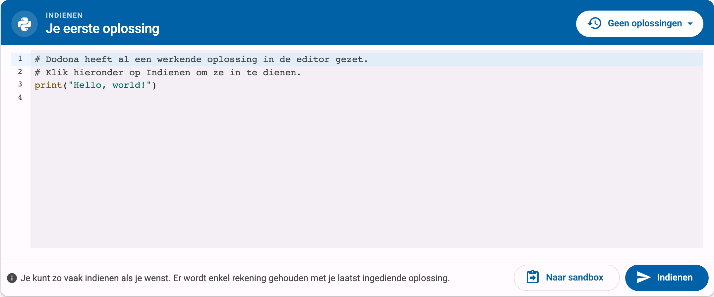
  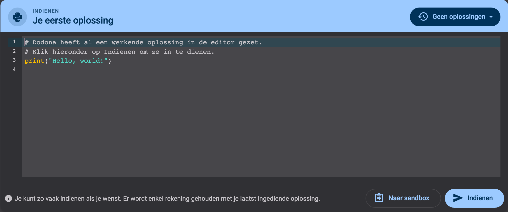

1. In de editor staat vaak al wat begincode. Je mag die aanpassen, aanvullen of helemaal weghalen.
2. Bij Python-oefeningen kun je je code eerst in je browser uitproberen met **Naar sandbox**. Je dient dan nog niets in, dus experimenteer gerust.
3. Ben je tevreden? Klik op **Indienen**. Dodona voert je code uit tegen een reeks testen en toont je binnen enkele seconden het resultaat.

### De feedback lezen

Slaagt je code voor alle testen, dan krijg je een groene **Correct**:

  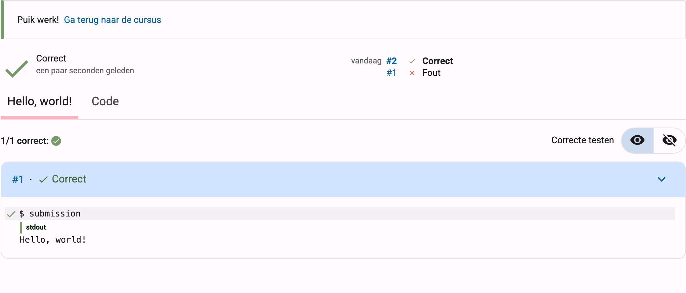
  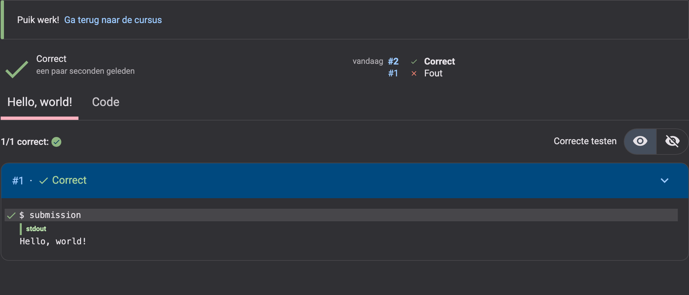

Zo niet, dan krijg je een rode **Fout**, en toont Dodona welke test faalde en hoe jouw uitvoer verschilt van wat er verwacht werd:

  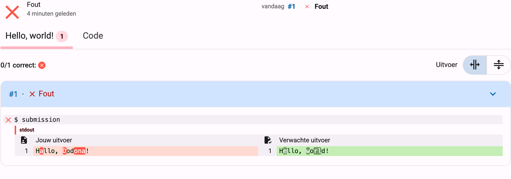
  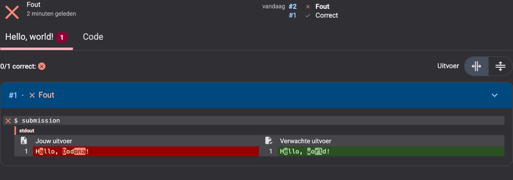

Drie gewoontes maken die feedback een stuk leesbaarder:

- **Begin bij de rode test**, niet bij de samenvatting. Die rode test is de enige die je iets bijleert.
- **Vergelijk de twee kolommen.** Links staat jouw uitvoer, rechts de verwachte uitvoer, en de tekens die verschillen zijn gemarkeerd. Let op de kleine dingen: een hoofdletter, een komma, een spatie op het einde van een regel.
- **Pas één ding aan en dien opnieuw in.** Vijf dingen tegelijk veranderen maakt het moeilijk om te zien wat geholpen heeft.

Het oordeel bovenaan de feedback is een van deze:

  <table class="table table-condensed">
    <thead>
      <tr style="background-color: var(--d-code-bg);">
        <th></th>
        <th>Oordeel</th>
        <th>Wat het betekent</th>
      </tr>
    </thead>
    <tbody>
      <tr>
        <td><i class="mdi mdi-check mdi-18 colored-correct" aria-hidden="true"></i></td>
        <td>Correct</td>
        <td>Alle testen slaagden.</td>
      </tr>
      <tr>
        <td><i class="mdi mdi-close mdi-18 colored-wrong" aria-hidden="true"></i></td>
        <td>Fout</td>
        <td>Je code liep, maar minstens één test gaf niet het verwachte resultaat.</td>
      </tr>
      <tr>
        <td><i class="mdi mdi-flash mdi-18 colored-wrong" aria-hidden="true"></i></td>
        <td>Uitvoeringsfout</td>
        <td>Je code crashte tijdens het uitvoeren. De foutmelding staat in de feedback.</td>
      </tr>
      <tr>
        <td><i class="mdi mdi-lightning-bolt-circle mdi-18 colored-wrong" aria-hidden="true"></i></td>
        <td>Compilatiefout</td>
        <td>Je code kon niet gelezen worden, meestal een typfout of een syntaxfout.</td>
      </tr>
      <tr>
        <td><i class="mdi mdi-alarm mdi-18 colored-wrong" aria-hidden="true"></i></td>
        <td>Timeout</td>
        <td>Je code deed er te lang over, vaak door een lus die nooit stopt.</td>
      </tr>
    </tbody>
  </table>

### Opmerkingen van je leraar

De testen zijn automatisch, maar je leraar kan je code ook zelf nalezen en opmerkingen bij bepaalde regels achterlaten. Die verschijnen bij je ingediende oplossing, onder het tabblad **Code**:

  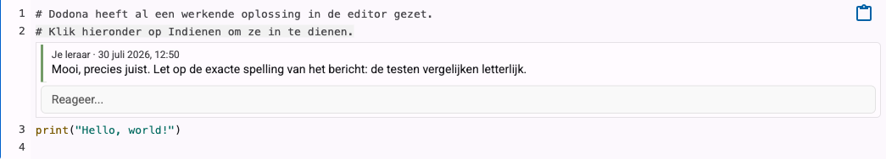
  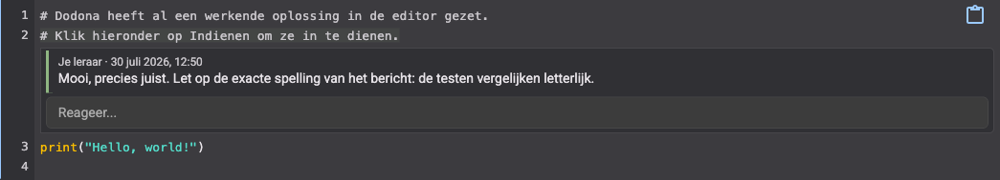

Je kunt er meteen onder antwoorden, dus zo'n opmerking is het begin van een gesprek en niet het laatste woord.

### Opnieuw indienen kost niets

Je mag zo vaak indienen als je wilt. Elke poging wordt bijgehouden en je kunt de oude terug openen via je ingediende oplossingen, dus niets van wat je probeerde gaat verloren:

  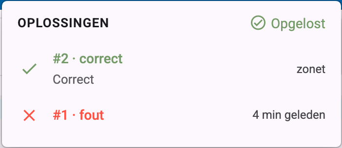
  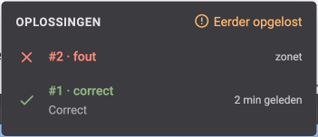

Normaal telt enkel je laatste oplossing, dus een foute poging kost je niets. Eerst iets fout doen is hoe de meeste mensen werken.

### Nu jij

Dat is alles wat je moet weten. Zette je leraar de oefening **Je eerste oplossing** hierna in deze reeks? Open ze dan nu: de oplossing staat al voor je klaar, dus je hoeft enkel op **Indienen** te klikken en te kijken hoe de feedback verschijnt.

En als je klaar bent met lezen: klik hieronder op **Markeren als gelezen**.

