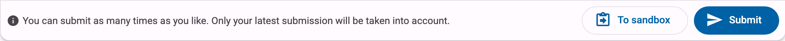
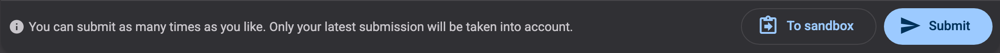

This is a **programming exercise**, which you recognise by the submission box at the bottom: you write code, you hand it in, Dodona runs a series of tests on it and gives you feedback.

The editor below already holds a complete, working solution for this exercise. You can hand it in exactly as it is and see what a successful submission looks like.

### Assignment

Write a program that prints this one line:

```console
Hello, world!
```

The test compares your output literally, so the words, the comma, the space and the exclamation mark all have to match.

### Handing it in

1. Look at the code in the editor below. Dodona filled it in for you.
2. Press the **Submit** button underneath the editor.
3. Wait a few seconds. Dodona runs your program and shows you the result.

<div class="dodona-centered-group dodona-shot">
  
  
</div>

If all went well, you get a green **Correct**.

> **Lost the starting code?**
> If you cleared the editor by accident, a link above the editor puts the original code back.
{: .callout.callout-info}

### Now try it the other way round

Once you have a correct submission, it is worth breaking it on purpose:

1. Change the message, for example to `print("Hello, Dodona!")`.
2. Submit again. This time the test fails and you get a red **Wrong**, showing the output the test expected next to the output your program produced.
3. Put the correct solution back and submit one more time.

Nothing can go wrong here: you may submit as often as you like, and only your latest submission counts.

<style>
  .dodona-shot img {
    max-width: 100%;
    height: auto;
  }
</style>
