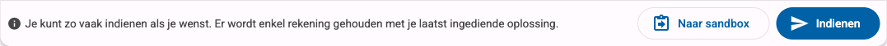
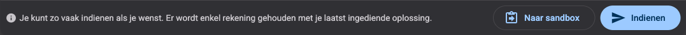

Dit is een **oefening**: je schrijft code in de editor, je dient ze in, en Dodona voert er een reeks testen op uit.

Je moet nog niets schrijven. In de editor hieronder staat al een volledige, werkende oplossing. Je kunt ze indienen zoals ze is, en zo zien hoe een geslaagde indiening eruitziet.

### Opgave

Schrijf een programma dat deze ene regel uitschrijft:

```console
Hello, world!
```

De test vergelijkt jouw uitvoer letterlijk, dus de woorden, de komma, de spatie en het uitroepteken moeten allemaal kloppen.

### Indienen

1. Kijk naar de code in de editor hieronder. Dodona heeft die al voor je ingevuld.
2. Klik op de knop **Indienen** onder de editor.
3. Wacht een paar seconden. Dodona voert je programma uit en toont het resultaat meteen op dezelfde plek.

<div class="dodona-centered-group dodona-shot">
  
  
</div>

Als alles goed ging, krijg je een groene **Correct**. Dat is je eerste opgeloste oefening op Dodona.

> **Begincode kwijt?**
> Heb je de editor per ongeluk leeggemaakt? Boven de editor staat een link die de oorspronkelijke code terugzet.
{: .callout.callout-info}

### Probeer het nu ook eens fout

Zodra je een correcte indiening hebt, is het de moeite om ze bewust stuk te maken:

1. Verander het bericht, bijvoorbeeld naar `print("Hallo, Dodona!")`.
2. Dien opnieuw in. Nu faalt de test en krijg je een rode **Fout**, met de uitvoer die de test verwachtte naast de uitvoer die jouw programma gaf.
3. Zet het terug en dien nog een keer in.

Er kan niets misgaan: je mag zo vaak indienen als je wilt, en enkel je laatste indiening telt.

<style>
  .dodona-shot img {
    max-width: 100%;
    height: auto;
  }
</style>
