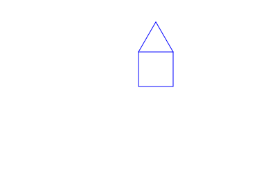

Draw a house. The base consists of a square with all sides measuring 50 pixels. The roof consists of a triangle. All sides of the triangle are also 50 pixels long. The overlapping side needs to be drawn only once and belongs to the square.

{:height="50%" width="50%"}{: style="border-style: inset"}