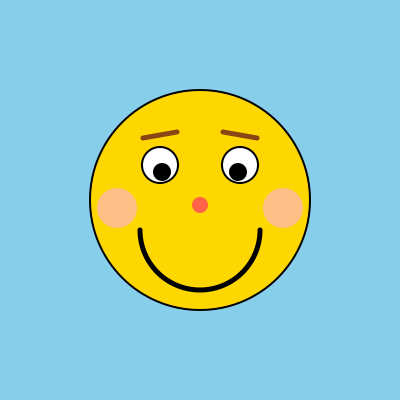

Time to get creative! In this exercise, you'll use the `turtle` module to draw a **smiley face**. Make it your own — there is no single right answer here.

Your smiley should have at least:
- A **face** (a circle is a good start!)
- Two **eyes**
- A **smile**

But don't stop there! You could also add:
- Colors — give your smiley a unique look
- Eyebrows — surprised, happy, or angry?
- A nose
- Rosy cheeks
- A hat, hair, or any other accessories
- A fun background

Experiment, play, and have fun with it. Here's one possible outcome for inspiration — yours can look completely different!

{:height="50%" width="50%"}{: style="border-style: inset"}

## Tips

Some useful `turtle` functions for drawing circles and arcs:

- `turtle.circle(radius)` — draws a full circle counterclockwise
- `turtle.circle(radius, extent)` — draws an arc of `extent` degrees
- `turtle.begin_fill()` / `turtle.end_fill()` — fill a shape with the current fill color
- `turtle.fillcolor("yellow")` — set the fill color
- `turtle.penup()` / `turtle.pendown()` / `turtle.goto(x, y)` — move without drawing
- `turtle.setheading(angle)` — point the turtle in a specific direction (0 = right, 90 = up)

{: .callout.callout-info}
> #### Automated feedback
>
> Your code will be checked for syntax errors and common code issues, but the correctness of your drawing is not verified automatically — this is only an indication of whether your code is syntactically correct. Make sure to look at your own output and verify that it matches what the assignment asks for.
